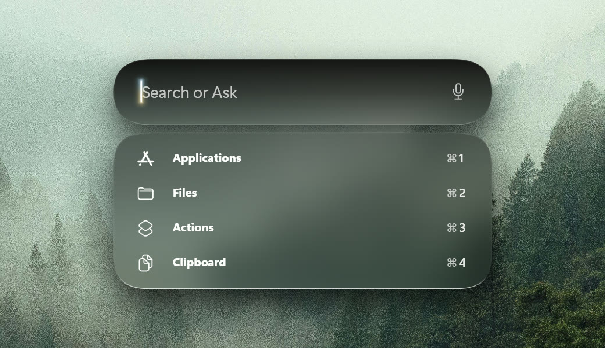
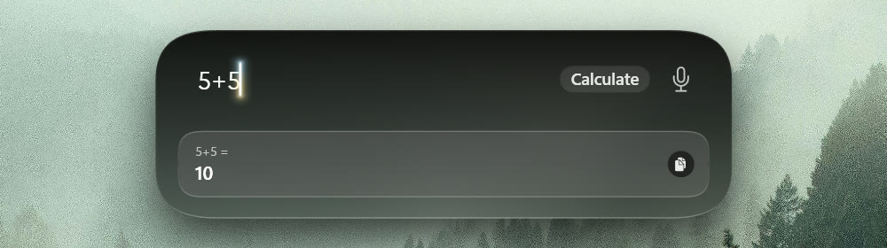
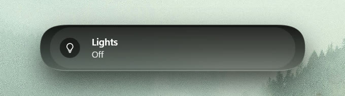
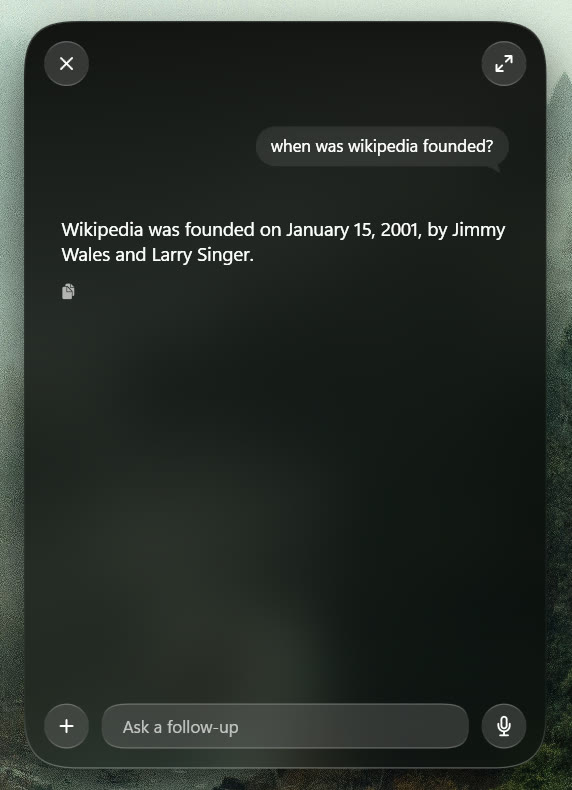

<h1>
  
  Kiri
</h1>

**Kiri** is a personal assistant for Windows 11, in the spirit of Siri and Apple Intelligence. Press **Alt+A** for a floating **Search or Ask** bar that finds your apps and files, does sums as you type, and answers questions with an AI model that runs **on your own PC**. No account, no server and no subscription. What you ask never leaves your PC unless you turn that on.

<p align="center">
  
</p>

<table>
  <tr>
    <td align="center" width="50%">
      
      <br/><sub>Sums answered as you type</sub>
    </td>
    <td align="center" width="50%">
      
      <br/><sub>Your home, through Home Assistant</sub>
    </td>
  </tr>
</table>

<p align="center">
  
</p>

---

<h2></h2>

- **A local AI model** (llama.cpp) on your graphics card or processor. Setup suggests a model for your PC and downloads it.
- **Search or Ask**: applications, files from the Windows Search index, actions and your clipboard history, in one bar.
- **Ask about what you are looking at**: a part of the screen (**Alt+Shift+S**), the text you selected, a page in your browser, or files from File Explorer's **Ask Assistant**.
- **Voice**: speak instead of typing, hear the answers, and wake it by saying **"Kiri"**. All of it runs on your PC.
- **Get things done**: alarms and timers in the Windows Clock app, lights and fans through Home Assistant, messages through Beeper, tasks in Microsoft To Do, and Todoist, Notion, Linear, Sentry or Discord. It always asks before it changes anything.
- **It remembers people**: say "message my brother" once and it knows who that is.
- **Local Only** is on from the first start. **Game mode** unloads the model while you play.

---

<h2></h2>

1. Go to the [**Releases**](../../releases) tab.
2. Download `Assistant-<version>-win-x64-Setup.exe`.
3. Run it. No administrator rights are needed. Setup then walks you through the AI model, the voice and your connections.

Kiri needs **Windows 11 22H2** or later on a 64-bit PC, and 8 GB of memory (16 GB recommended). A graphics card is optional.

To **uninstall**, use *Settings → Apps → Installed apps → Assistant → Uninstall*. Your conversations and settings are kept in `%LOCALAPPDATA%\Assistant` unless you ask for them to be removed.

---

<h2></h2>

| Shortcut | What it does |
| --- | --- |
| **Alt+A** | Opens the Search or Ask bar; press it again to put it away. |
| **Alt+Shift+S** | Visual search: drag over a part of the screen and ask about it. |
| **Alt+Shift+W** | Ask about the text selected in the app in front. |
| **Alt+Shift+C** | The same for apps that do not share their selection (off until you allow it). |

The icon in the notification area opens the full window with all your conversations. Shortcuts can be changed in Settings.

---

<h2></h2>

While Kiri is running, it looks for a new release on this repository as it starts and when you open it, at most **once every 30 days**. All it sends is the request for the latest release: nothing about you or what you ask. When one is out it offers to open the release page, or to ignore that version. To check now, open *Settings → About → Check for updates*.

---

<h2></h2>

| Tool | Why |
| --- | --- |
| [.NET 8 SDK](https://dotnet.microsoft.com/download/dotnet/8.0) (8.0.400 or later) | Builds the app. |
| [Inno Setup 6](https://jrsoftware.org/isinfo.php) | *(Optional)* Builds the installer. |

```powershell
git clone https://github.com/MouayadYT/Kiri.git
cd Kiri
dotnet build Assistant.sln -c Release
dotnet run --project src\Assistant.UI -c Release
```

To build the installer, run `.\packaging\Build-Installer.ps1`. It writes `artifacts\installer\Assistant-<version>-win-x64-Setup.exe`, where the version comes from `version.txt`. Every push to `main` builds it on GitHub Actions and attaches it to a **draft release** for that version.

```
src/          the app (Assistant.UI) and its modules, model host, File Explorer entry and browser extension
tests/        one test project per module
packaging/    the package and installer scripts
third_party/  the bundled llama.cpp engine and the voice notices
```

---

<h2></h2>

Made in collaboration by [**MouayadYT**](https://github.com/MouayadYT) and [**MuhannadYT**](https://github.com/MuhannadYT).

Powered by [**llama.cpp**](https://github.com/ggml-org/llama.cpp) (MIT) for the AI model and [**sherpa-onnx**](https://github.com/k2-fsa/sherpa-onnx) (Apache 2.0) for the voice. Their notices are in [`third_party/`](third_party).

---

<h2></h2>

Kiri is licensed under the **GNU Affero General Public License v3.0 (AGPL-3.0)**. See [LICENSE](LICENSE) for the full text.

In short:

- You are free to use, study, modify, and share Kiri.
- If you distribute it **or run a modified version that users interact with over a network**, you must publish your modified source code under AGPL-3.0 as well.
- This means you cannot take Kiri, fold it into a closed-source product, and ship that: any derivative work must remain open source under AGPL-3.0.

The bundled parts keep their own licenses: llama.cpp (MIT), sherpa-onnx and ONNX Runtime (Apache 2.0 and MIT), and espeak-ng inside the voice runtime (GPL-3.0). Their notices are in [`third_party/`](third_party).
